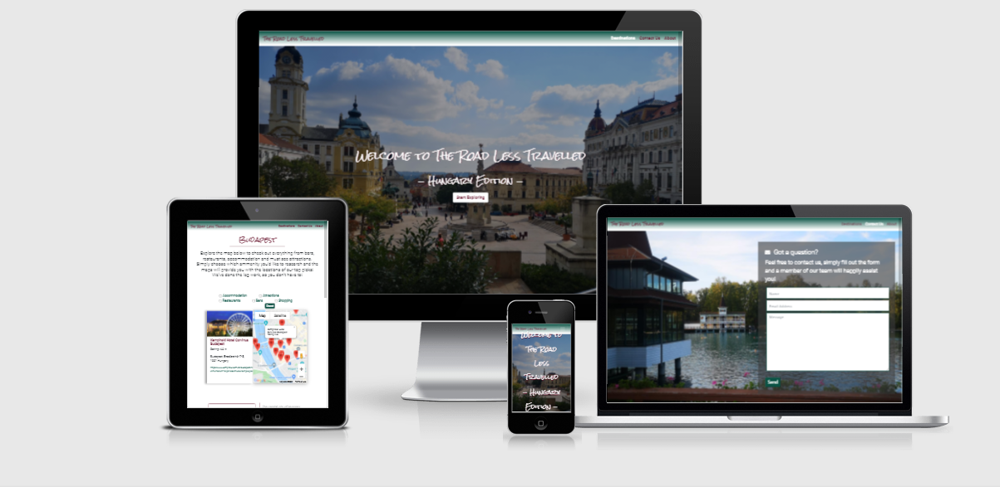
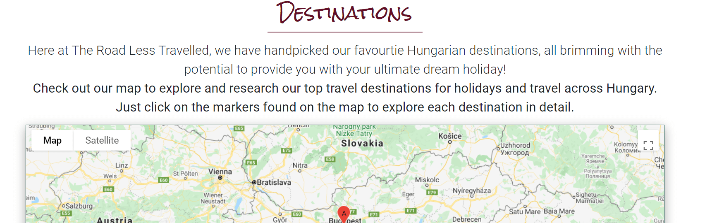
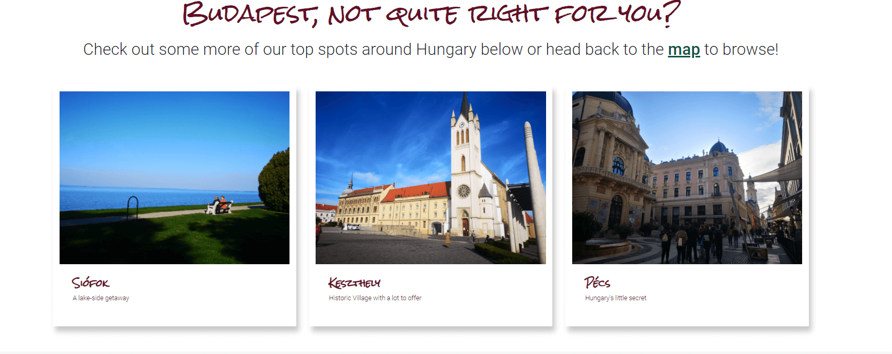
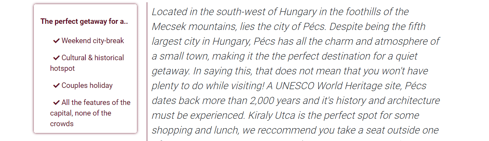
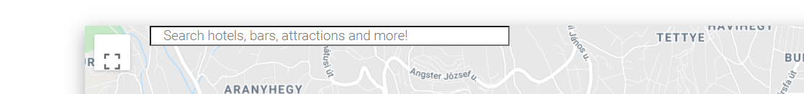
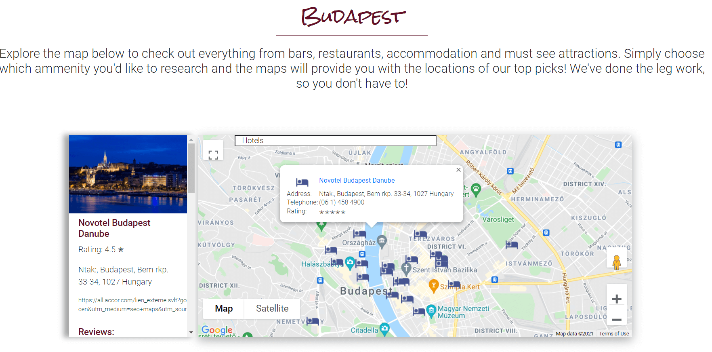
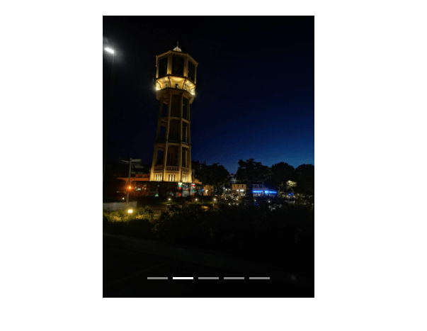
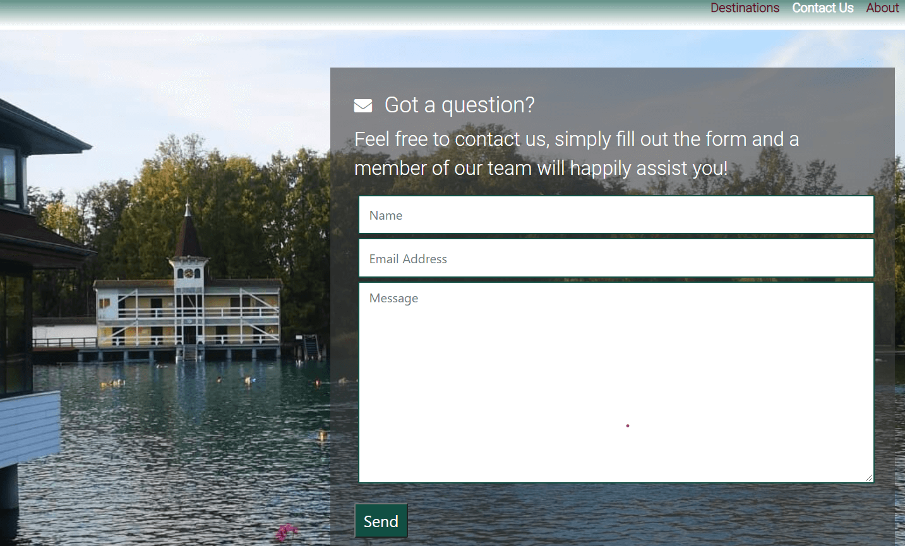

# The Road Less Travelled - Hungary Edition
*The Road Less Travelled* is an interactive front-end site that aims to help users find their perfect Hungarian holiday destination. *We've done the leg work so you don't have to!* Browse the site to discover our top four destinations around Hungary to find your dream holiday destination. Our site provides you with up-to-date information on accommodation, amenities, and the best bars and restaurants in the area! We've provided all the information that you'll need in one place to research holiday destinations around Hungary to help you choose your perfect destination.  

# Demo
Access the live site [here](https://ksheeds1.github.io/The-Road-Less-Travelled-Hungary-Edition-/)

# UX
## User Stories
> *As a user, I want to be able to navigate the site quickly and easily to find what I am looking for.*

> *As a user, I want to be able to ascertain the purpose of the site.*

> *I have already been to Budapest twice and I want to know what other kind of locations are available to me if I don't want to visit capital again?*

> *As an experienced traveller, I like to research my trips in advance so that I can find a travel destination that isn’t overrun with tourists.*

> *As a user, I like to see the amenities available in an area or location I'm researching displayed in a suitable format.*

> *I'm booking a surprise getaway for my significant other and I want to know more than just the locations of the different accommodation options offered in Budapest, how can I find out more?*

> *As a user, I would like to be able to visualise the location I'm researching, getting to see images of the location I may potentially visit helps to inform my decision.*

> *I have been exploring the site and have a query, the answer doesn’t seem to be available on the website, I would like to find out more about it, is this possible?*

> *As a user, I want to be able to check out social media accounts associated with site to keep up to date with new information and locations.*

## Strategies:
### Purpose & Objectives: 
* The purpose of the site is to provide a well-structured platform where users can explore a variety of holiday destinations around Hungary. The Road Less Travelled not only showcases top holiday destinations but has all the practical information needed to choose the location best suited to the user.
Site users can easily research what amenities are available in each location through the interactive map, check out photos of each destination, follow our social media accounts to be kept up to date or, reach out to our team via email. 
The site establishes Hungary as a worthy alternative to mainstream European holiday destinations, that tend to be more expensive due to popularity, by showcasing all that Hungary has to offer as a holiday or travelling destination. 

* The objective of this site is to provide practical information regarding local amenities for different locations around Hungary. The site owner has chosen to use interactive maps, to display information and options for accommodation, restaurants, attractions, and shopping for each of our featured destinations.
Interactive maps provide a suitable format to display such information, allowing the user to understand the information provided visually while also providing much needed context that may be lost through other formats.
The addition of image carousels provides further visual context to each location and the information provided through the maps.  
Each of the featured destinations also come with background information on all locations and relays whether the chosen destination best suits the type of trip the user is looking to have, be it a family holiday, city break, couples holiday or for a stag or hen party.  
  
### Owner Goals:
* To establish a well-structured, interactive site that is both aesthetically pleasing and user friendly in design. 
* Aid users to research potential holiday or travel destinations across Hungary and find all the necessary information needed to make an informed decision in one place.
* To display information in an easily digestable format such as an interactive map and image carousels.
* To establish a means of contact between users and the site owner via email.
* To provide site access across mulitple devices for viewing on the go. 

## Scope:

The functional requirements put in place help aid the user to access the content they are looking for quickly and easily.

The required content for the website is: 
* Interactive maps which provide detailed information about each location
* Location images
* General content on each location 
* Contact form 

## Structure: 

* The site is designed to foster intuitive learning; the aim is to provide an intuitive interaction between the user and the website. 
* Content is structured logically and grouped categorically.
* Users can quickly identify and access the information they are looking for.

## Skeleton: 
### Landing page wireframes:
[Landing Page desktop](assets/wireframes/landing-page-desktop.png)

[Landing Page mobile](assets/wireframes/landing-page-mobile.png)

[Landing Page tablet](assets/wireframes/landing-page-tablet.png)

### Budapest page wireframes:
[Budapest Page desktop](assets/wireframes/budapest-page-desktop.png)

[Budapest Page mobile](assets/wireframes/budapest-page-mobile.png)

[Budapest Page tablet](assets/wireframes/budapest-page-tablet.png)

### Pecs page wireframes:
[Pecs Page desktop](assets/wireframes/pecs-page-desktop.png)

[Pecs Page mobile](assets/wireframes/pecs-page-mobile.png)

[Pecs Page tablet](assets/wireframes/pecs-page-tablet.png)

### Siofok page wireframes:
[Siofok Page desktop](assets/wireframes/siofok-page-desktop.png)

[Siofok Page mobile](assets/wireframes/siofok-page-mobile.png)

[Siofok Page tablet](assets/wireframes/siofok-page-tablet.png)

### Keszthely page wireframes:
[Keszthely Page desktop](assets/wireframes/contact-page-desktop.png)

[Keszthely Page mobile](assets/wireframes/contact-page-mobile.png)

[Keszthely Page tablet](assets/wireframes/contact-page-tablet.png)

### Contact page wireframes:
[Contact Page desktop]()

[Contact Page mobile]()

[Contact Page tablet]()

### About page wireframes: 
[About Page desktop](assets/wireframes/about-page-desktop.png)

[About Page mobile](assets/wireframes/about-page-mobile.png)

[About Page tablet](assets/wireframes/about-page-tablet.png)

## Surface:
The majority of content on the site has been aligned centrally, this remains consistent across all viewports. The navigation bar is fixed in the default position and allows the user to quickly identify the different sections of the site. 

### Color Scheme: 
The site owner chose three contrasting colors for the site's color palette. #fffff has been used as the background color for several of the site's pages to provide a clean, contrasting background to the content.
#0b5345 has been used for both buttons and the input labels for the checkboxes found above the maps as well as for some content. 
A linear gradient (#0b5345 0%, #ffffff 93%) utilises the main two colors used through site and has been applied to both the navigation bar and the footer to give the illusion that the nav-bar and footer are gently fading into the body.
#640e27 has been added to provide a contrasting accent to a the color scheme. It features prominently throughout the text across the site. 

### Typography: 
The site owner chose two fonts to use across the site, "Rock Salt" and "Roboto". Rock Salt is primarily used for headings as the font is only available in uppercase, it was chosen for its almost handwritten quality. For the site owner, this font pays homage to the handwritten research done prior to the trip that inspired this site.
Roboto was chosen for its clean and legible form, as a popular choice on Google Fonts, the site owner believed it would cultivate a sense of familiarity amongst users. As well as providing a good contrast to Rock Salt. 

### Images: 
The site owner made use of images as backgrounds for two pages of the site contact.html and about.html. The use of images across a travel site is pivotal to its purpose. All images used throughout the site belong to the owner and were taken while travelling across Hungary in the Autumn of 2019. 
The hero image the site opens on was chosen for its perspective and depth, the colors are muted slightly by the overlay added to make sure the text isn't lost in the image. 
Image carousels have been utilized across the site to provide further visual context about each of the destinations to the user. 

# Features
## Existing Features:

**Navigation Bar:**

* Fixed in the default position, allowing users to quickly identify the different sections of the site. On mobile screen widths, these sections are available in a collapsible menu to provide a cleaner layout on smaller screens. 

**Google Maps API:**

* To provide users with a more interactive experience, each location HTML page includes a map of the destination where users can view all amenities available in the area. 
With user interaction and engagement in mind, a site visitor can simply toggle between the amenities on the map using the radio buttons placed above the map. 

**Bootstrap Carousel API:**

* An image carousel has been added to the landing page and each destination page, to draw site users in, presenting images of the destinations advertised on the site will encourage further interaction and exploration of the site. 

**Contact form via EmailJS API:** 

* With the integration of EMAILJS API, users can get in touch with The Road Less Travelled team, with any questions they may have by simply filling out the form found on the contact page, improving the overall user experience and a custom service and satisfaction.

**Social media links:**

* Links to The Road Less Travelled social media accounts will be provided in the footer of the site. This allows for further engagement with current site visitors , as well as providing an opportunity to endorse and advertise the website to a diverse demographic of users across several platforms, in the aim of increase web traffic. 

## Features left to implement:

For future releases, the aim is to expand the site to include other countries to offer an even larger variety of holiday destinations located in Eastern Europe. Finally categorising this content as "The Eastern Europe Edition". This would see the implementation of new features such as:

**Filter option for destinations:**

* The developer intends to implement a filter option throughout the site, allowing the users to search destinations by price, locations, seasonal getaways, and package holidays. 

**Find your dream location quiz:** 

* Users can answer a series of questions that provide multiple choice answers. Depending on the answers selected by the user, the quiz will generate their ideal holiday destination and redirect them to the locations page.  

**The inclusion of relevant APIs:**

* The integration of a variety of APIs accommodation such as Trivago and Booking.com, currency conversion, as well as transport, including Flexibus and SkyScanner. The integration of the Sky Scanner API into the site is contingent on the reopening of international borders and the decrease of travel bans globally. 
Given the prevalence of COVID-19 globally and it's effects on international travel, the site owner has decided to delay the integration of the Sky Scanner API, until such a time, that international travel is less restricted and that the inclusion of the API will provide additional value for the user. Until then, it's integration has been tabled for a future release.
These APIs would provide the users with the ability to book all elements of their trip from the one site, while also allowing them to research the location and its amenities at the same time. 

**Implementation of live chat software:**

* To provide website users with an alternative method of communication with The Road Less Travelled team in real time, via chat windows. The implementation of live chat software will provide a quicker means of communication with users compared to email, whilst improving user interaction and satisfaction. 
The owner goal is to be able to provide users with any additional information they may need as quickly as possible to maintain visitor engagement with the site. The addition of live chat software will help achieve this goal. 

# Technologies Used 

**Balsamiq:**
* Was used to build the initial mockups or wireframes for this site during pre-development stage of the project.

**Gitpod IDE:**
* The sole IDE used to build the site. 

**Git:**
* Used for version control, to store versions and track changes in any set of files. 

**Github:**
*  Used to host both this repository and site.

**HTML5:**

* The site uses HTML5 Doctype to create all HTML files. 

**CSS3:** 

* This site uses CSS3 to provide styling to all HTML files. 

**JavaScript:**

* This site uses JavaScript to implement interactive features such as the Google Maps API for the integration of custom maps and EmailJS API to provide a functional email service with site users.

**Bootstrap v4.5:**

* The site uses Bootstrap to provide components such as grid-layouts, forms, image carousels, as well as classes to further style elements of the site.

**JavaScript Plugin:**

* This plugin is used in conjunction with Bootstrap, a necessary component for Bootstrap Plugins. 

**Popper:**

* Is used in conjunction with Bootstrap, it is used in this project to provide tooltips specifically for the contact form. 

**Google Maps JavaScript API:**
* This API was used to render the maps found on this site, as well as the additional functionality added such as interactive markers, infoWindows, and the Place Details provided for each marker rendered on an infoPane to the left of the map.

**EmailJs:**
* This API was used to establish a means of contact between the site and its users through a contact form. The API allowed the site owner to build a custom template and allow the user to send emails via JavaScript.

**Font Awesome:** 
* Provided the icons used throughout the site to grab users attention, provide additional context visually for different elements of the site, and further enhance UX. 

**TinyPNG:**
* All images/PNG files used on this site were first reduced in file size using TinyPNG. 

**Am I Responsive?:**
* Was used to provide a visual representation of the site across multiple device viewports as seen in the 'Demo' section of this README file.

**Autoprefixer:**

* The 'style.css' file of this project was parsed and has had vendor prefixes added to allow animations, grids, transitions, etc. to function across multiple browsers.

**HTML Validator:**

* All .html files from this project were validated and deemed error-free by the HTML Validator. 

**CSS Validator:**

* The 'style.css' file of this project was validated and deemed error-free by the CSS validator.

**JSHint v2.12.0:**

* All JavaScript files from this project were validated and deemed error-free by JSHint.

# Testing

## Bugs discovered and resolved during development:
**Markers as links** 

In an effort to create a more interactive website, the developer aimed to create a map where the markers could be used to redirect the user to other pages of the site, about different locations in Hungary, depending on which marker was clicked.
The developer created an array "markerLocations" containing several keys of information on each location, including the URL for each location page. 
The URL was passed in the for loop within the initialisation of initMap to call and create the markers located on the map found on index.html. 
To achieve the desired functionality, an event listener was added to the markers, listening for a click event, triggering window.location.href property which created a pathway to redirect the user to the HTML page of the markers location. 

**Multiple maps and creating markers**

The developer chose to initialise the maps separately, creating an initialise function for each map. However, upon creating of the fifth and final map a bug was found. 
Four of the location maps were initialised and set up to display the request of restaurant to trial the functionality of the maps. Each map was initialised one at a time and checked to make sure that each map was displaying markers as another map was added. 
Following the initialisation of the final map, all markers from all maps bar the final map had disappeared. The error being thrown in the console referencing the final map initialised. 
Upon further inspection, the bug was narrowed down to the "createMarker" functions, as the developer chose to initialise the maps separately, each contained their own "createMarker" function which effectively led to the function being redefined each time. 
This clarified why the markers were only displaying on the last map initialised. In order to correct this, the developer chose to declare a global variable "currentMap" and assign each map to it within the initialisation functions. 
Each callback function was moved inside the initialisation functions, where the createMarker function was called, passing the results as a parameter.
While this resolved the issue and the markers were displaying on each map, a new error was thrown, indicating there was an issue with the order in which elements were being loaded. Further inspection led to the removal of the "onload=initMaps" attribute from the body tag of index.html. 
This attribute attempted to load the map div, which had not been created at the time.     

**From Text Search to Autocomplete Search Bar**
The developer initally began this project using the Places 'Text Search' to retrieve data from both the Maps & Places APIs and did so successfully. In order to provide users with as many amenities as possible the developer passed five 'types' within one request and stored the markers for each of the types the developer wanted to display on the maps. 
To create the markers, the results from the text search request were passed to the function 'createMarker'. The results and types were then iterated through a nested for loop  the results  paswsed from createMarker were pushed into the object. 
was pushed into an Object. The aim was to toggle between the different amenities using either radio buttons or checkboxes, in order to do this the input elements were added to the class 'selectedAmenities' and looped through to get their ID. Using the ID as a key for the object storing the marker data, the 'checked' 
selectedAmenity was then passed to an empty an empty array 'filteredAmenityLocations' containing the relevant data or markers to be displayed on the map. The developer then iterated through filteredAmenityLocations and attempted to create markers using the results of the loop and setting the markers as visible.
However despite multiple attempts to display the markers the developer had no such luck. This is most likely due to the strict structure of the text search requests and the attempt to display more than one 'type'.
In the hope of still being able to provide site users with as much information as possible, the developer chose to remove the Places Text Search in exchange for the Places Autocomplete Search Bar widget. 
This provided a much cleaner solution to the issue at hand and also broadened the scope of data available to the user as well as increasing interactivity with the map. Used in conjunction with 'getDetails' the user can click on the markers and the side bar displays additional information for each place.id.

**EmailJS**

The developer initially set up the EmailJS API using the steps outlined in the walkthrough video for the EmailJS lesson from the interactive frontend module and gained functionality. 
However, this functionality was short lived and began throwing errors in the console, surrounding a HTTP status code 400 - bad request, which translated to an issue with the user ID, necessary for the initialisation of the API. 
Although the user ID was previously initialised during the init method, the developer added it to the function in an attempt to resolve the bug, but this was not successful. In an effort to resolve this, the function put in place was replaced, in line with the documentation outlined on the dashboard of EmailJS for such status codes. 
The addition of an error/success console.log provided more information. Throwing a HTTP status code 200, this clarified that the account was indeed linked to the site however it still threw a status code 400 for a bad request, requiring the user ID. 
While attempting to debug the issue, it was noticed that parts pf the HTML for the form was set up in line with the older version of EmailJS, this was altered inline with the documentation, as well as the javascript file "sendEmail.js" being altered using the newer version of "email.sendForm" method to collect the values of the form and pass them to the specified template, with the method returning the promise. 
This finally cleared the status code 400 and functionality was established.

**Triggering the customAlert upon email submission**
The developer initally began with a standard alert to confirm submission of the email with the user but chose to build a custom alert to convey the message and allow for cross site continuity in styling, using a jQuery dialog widget 
Using an on click event listener to trigger the alert on click of the 'submit' button, this only prompted the dialog widget to show prior to the email being sent. I twas also noted that the alert showed even if the form hadn't been filled in and therefore validated.
This was eventually solved once the developer passed the on click listener event through the function for successful submission. The form then had to be filled out and validated as well as having confirmation of email submission before launching the custom alert. 

## User Stories tested:

* UST1: 
> *As a user, I want to be able to navigate the site quickly and easily to find what I am looking for.*

Users can easily identify the different sections of the website using the navigation bar, placed in the default fixed position it is accessible to users at all times to quickly navigate across the site.
To visit the destinations site, the user can simply click on destinations, or to get in contact with The Road Less travelled team, they can simply click on the Contact Us page.

* UST2:
> *As a user, I want to be able to ascertain the purpose of the site.*

The site's purpose is explained to the user on the landing page just above the map. It encourages the user to click on a marker to learn more about a certain location, once a marker is clicked the user is 
relocated to a page dedicated to that location where they can explore the options available to them using the map, look at photos and learn about their potential holiday destination. 

* UST3:
> *I have already been to Budapest twice and I want to know what other kind of locations are available to me if I don't want to visit capital again?*

Users can look at the other featured locations offered at the bottom of each location page, they can simply click on the card to explore a different direction or click on the word map to be brought back to the destinations map.

* UST4:
> *As an experienced traveller, I like to research my trips in advance so that I can find a travel destination that isn’t overrun with tourists.*

Each location comes with a 'perfect getaway for' card which gives the user an idea of what kind of trip this location will offer, busy capital city, cultural & historical hotspot. They can also get a feel for each location from the brief aside 
providing contextual info. 

* UST5:
> *As a user, I like to see the amenities available in an area or location I'm researching displayed in a suitable format.*

The implementation of the search bar along side the map broadens the scope of information available to the users. By simply typing bar, hotel, pizza, attractions into the search bar the map will return the results within the surrounding location.

* UST6:
> *I'm booking a surprise getaway for my significant other and I want to know more than just the locations of the different accommodation options offered in Budapest, how can I find out more?*

By simply typing in 'hotels' into the search bar the map produces all types of accommodation available in the area, the users can click on each marker to find out more about the hotel like its price rating, address or reviews. 

* UST7:
> *As a user, I would like to be able to visualise the location I'm researching, getting to see images of the location I may potentially visit helps to inform my decision.*

Each location comes with a carousel of images from each of the location so users can get a look at their potential holiday getaway, the carousel loops through the images and users can flick back and forth between them too.

*UST8:
> *I have been exploring the site and have a query, the answer doesn’t seem to be available on the website, I would like to find out more about it, is this possible?*

Users can reach out to the Road Less Travelled team by clicking 'Contact Us' in the nav-bar and are instantly redirected to our contact form where they can simply fill it out and send it!

*UST9:
> *As a user, I want to be able to check out social media accounts associated with site to keep up to date with new information and locations.*

The social media accounts linked to the site are available in the footer, simply scroll to the bottom of any of the pages and click on the icon of your chosen social media platform to follow us.

# Deployment

## Git: 
### Using Git to add, commit and push code into a repository: 

Storing files in Git is a two-stage process:
​1.  Files must be added to the staging area using the "**git add**" command followed by the specified file name.
​2. Files must be committed to the repository using the "**git commit -m**" command followed by a specified message within double quotation marks. **Note:** that it is common practice when making your first commit to a repository to provide the message "**initial commit**".

### Pushing code to GitHub:
This is achieved by connecting your local repository with your remote repository and pushing the code from local to remote.  Storing your code in a remote repository on a remote server allows it to be backed up and also be accessed by others.

**To back up your code:**
* Start from the terminal by pressing **CTRL+C** to stop the server.
* Run "**ls**" to list the files. 
* Begin adding and committing the code as outlined in step 1 & 2 of storing files in Git.
* Run "**git status**" to view all files added to the staging area. 
* Run "**git commit -m**" followed by your message contained in double quotation marks, adding the files to your local repository. 
* Once the files have been committed, push them to the remote repository using "**git push**".

## GitHub:
This site is hosted by GitHub Pages, the publishing source chosen was the 'master' branch. To choose a publishing source and deploy the site:

* Navigate to the site's **repository**

* Under the repository name, click **Settings**

* Under **GitHub Pages** use the **branch drop-down menu** and select **'Master'** as the publishing source.

* Click **Save**

To run **locally**, you can clone this repository, or pull the code from this GitHub repository:

* Navigate to the main page of the repository

* Click the **green code button** 

* To clone the repository using **HTTPS**, under **'Clone with HTTPS'**, click the **clipboard** symbol

* Open Git Bash

* Change the current working directory to the location where you want the cloned directory

* Type **git clone** and paste in the copied URL

`$ git clone https://github.com/KSheeds1.github.io/The-Road-Less-Travelled-Hungary-Edition-/` 

* Press **Enter** to create your local clone

### Fork this repository: 
A fork is a copy of a repository. Forking a repository allows you to freely experiment with changes without affecting the original project. 

To fork this repository:
* Log into GitHub and navigate to this repository here: https://github.com/KSheeds1/The-Road-Less-Travelled-Hungary-Edition- 
* In the top-right corner of the page, click **Fork**. 

## Google Maps JavaScript API: 

**Please note:** 

Before using the Maps JavaScript API, you need a **project with a billing account**, this can be set up following the steps outlined here: [https://developers.google.com/maps/gmp-get-started]. 
Once you have created a billing account and project, you can begin using the Google Maps Platform API. 

* To use Google Maps Platform, you must **enable the API** you plan to use with your project on **Cloud Console**. 
* After setting up your Google Cloud project, you must **create and secure your API Key** to use the Maps JavaScript API. 

### Creating API Keys: 
To create an API key: 
1. Got to the **APIs & Services > Credentials** page.
2. On the **credentials** page, click **Create credentials > API key**. The **API key created** dialog displays your newly created API key.
3. Click **Close**. The new API key is listed on the **Credentials** page under **API keys**. 

### Restricting API keys:
**Please note:** 

**Restricting API keys** adds security to your application by ensuring only **authorized requests are made with your API Key**. To set restrictions for your API key follow the steps outlined here: https://developers.google.com/maps/api-key-best-practices#restrict_apikey

### Adding the API key to your request: 
You must include an API key with **every Maps JavaScript API request**. In the following example, replace `YOUR_API_KEY` with your API key.

``

## Maps JavaScript API - Places Library: 
**Please note:** 

If you are unfamiliar with the Maps JavaScript API, it is recommended that you **get an API Key prior to getting started**. 

### Enable APIs:
Before using the Places library in the Maps JavaScript API, first ensure that the **Places API is enabled in Google Cloud Console**, in the **same project set up for the Maps JavaScript API**.  

1.Go to the Google Cloud Console.
2. Click the **Select a program** button, then select the same project you set up for the Maps JavaScript API and click **Open**.
3. From the list of APIs on the **Dashboard**, look for **Places API**. 
4. If you see the Places API in the list, it's already enabled. If the API is is *not* listed, enable it: 
     ​* At the top of the page, select **ENABLE APIS AND SERVICES** to display the **library** tab.
     ​* Search for **Places API**, then select it from the results list. 
     ​* Select **ENABLE**. When the process finishes, **Places API** appears in the list of APIs on the **Dashboard**. 

### Loading the library: 
To use the functionality contained with this library, you must **first load the `libraries` parameter in the Maps API bootstrap URL:**

``

**Please note:** 
Don't forget to **add the Places API to the API key's API restrictions list**. To set restrictions for your API key follow the steps outlined here: https://developers.google.com/maps/api-key-best-practices#restrict_apikey 

## EmailJS:

To enable the use of the EmailJS API:
* Create your free account here: https://dashboard.emailjs.com/sign-up
* Add an **email service**. The owner of this site set up a **personal email service**, following the recommendation set out by EmailJS to use personal email services **for development only or for very low volume usage**. 
* Choose **Gmail Service** 
* Provide a **name** and **service ID**. 
* Connect your account by hitting the "**Connect account**" button and pressing the "**Add Service**" button to complete the process.
* To create an email template:
    ​* Go to **Settings** and set the name as **Contact Form** and the template ID as **Contact_form**.
* Go to **Content**.
* The **message** variable will contain the content of the message. The **user_name** and **user_email** are the user's name and email address, respectively.
* Fill in the **email fields**. 
* **Save** the template by pressing the "**Save**" button. The contact form can be found in **Email Templates**.

### Connecting the form and sending an Email:
* Load the EmailJS SDK in the HTML file: 

``

* Initialize the SDK with your User ID: 

`emailjs.init('YOUR_USER_ID');`

* Submit the contact form and send it through EmailJS using the **Contact Service** and **Contact Form**: 
`emailjs.sendForm('contact_service', 'contact_form', this)`

# Credits
## Content:

All content found on this site was written by the developer. 

## Media:

All images found on this site are my own personal property.

## Acknowledgements 
